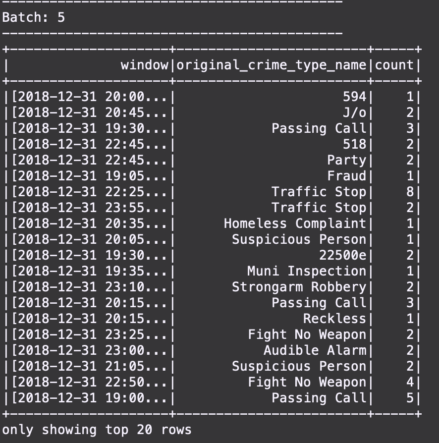

## Project: SF Crime Statistics with Spark Streaming

### Objective
In this project, you will be provided with a real-world dataset, extracted from Kaggle, on San Francisco crime incidents, and you will provide statistical analyses of the data using Apache Spark Structured Streaming. You will draw on the skills and knowledge you've learned in this course to create a Kafka server to produce data, and ingest data through Spark Structured Streaming.



Development Environment:
- Spark 2.4.3
- Scala 2.11.x
- Java 1.8.x
- Kafka build with Scala 2.11.x
- Python 3.6.x or 3.7.x

Environment Setup:
- Download Spark from https://spark.apache.org/downloads.html. Choose `Prebuilt for Apache Hadoop 2.7 and later`
- Unpack Spark in one of your folders (I usually put all my dev requirements in `/home/users/user/dev`)
- Download Scala from the official site or for Mac users, you can also use `brew install scala` but make sure you download version `2.11.x`
- Run below to verify correct versions
```
java -version
scala -version
```
- Make sure your `~/.bash_profile` looks like below (might be different based on your directory)
```
export SPARK_HOME=/Users/dev/spark-2.3.0-bin-hadoop2.7
export JAVA_HOME=/Library/Java/JavaVirtualMachines/jdk1.8.0_181.jdk/Contents/Home
export SCALA_HOME=/usr/local/scala/
export PATH=$JAVA_HOME/bin:$SPARK_HOME/bin:$SCALA_HOME/bin:$PATH
```

### Running this project

### 1. Starting the Project
Use commands below to start zookeeper/kafka server.

```
bin/zookeeper-server-start.sh config/zookeeper.properties
bin/kafka-server-start.sh config/server.properties
```
Start the server using python command:
```angular2html
python producer_server.py
```

### 2. Build the Kafka server
To build a simple Kafka server you can follow this steps, using the command `bin/kafka-console-consumer.sh --bootstrap-server localhost:9092 --topic <your-topic-name> --from-beginning` to see the output.

### 3. Runing Apache Spark
In `data_stream.py` use this command:
```
spark-submit --packages org.apache.spark:spark-sql-kafka-0-10_2.11:2.3.0 --master local[4] data_stream.py
```
